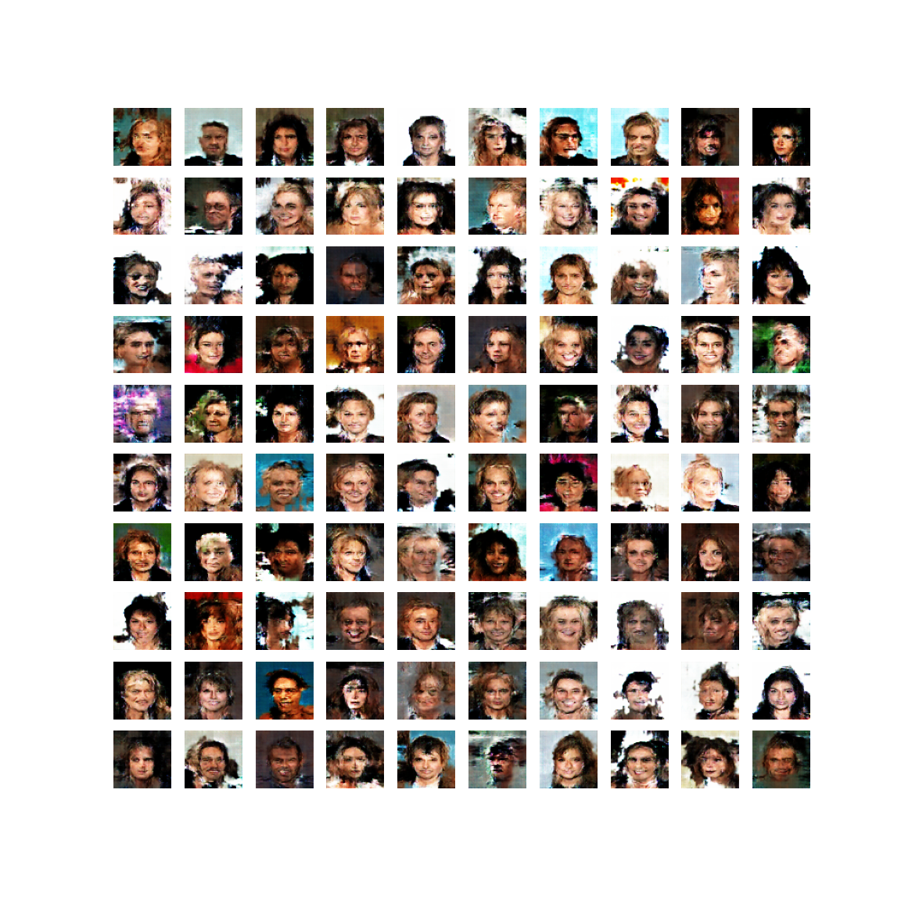

# GAN_CelebA
An implementation for the task of generating human faces by training DCGAN on the CelebA dataset. 
In this project, i implements several tricks and tips for training DCGAN, such as :
- Gan hacks from https://github.com/soumith/ganhacks
- Unrolled GAN technique (to overcome "mode collapse" problem)
- Self-attention layer (because each image in the dataset has a large area for background, so i added self-attention layer to GAN structure with the hope that the model would focus more on the forthground).

# Requirements
- keras==2.3.1
- tensorflow==1.15.0
- opencv==3.4.3

# Training
Simply run the file "Self-Attention/attention_unrolled_GAN.py" .
After training completed, weight would be saved to folder "Self-Attention/save_attn". After a certain number of epochs, generated image and training history of the model during training would be also saved to folder "Self-Attention/save_attn".

#Demo
Demo images generated by the generator after training for about 2300 epochs:

